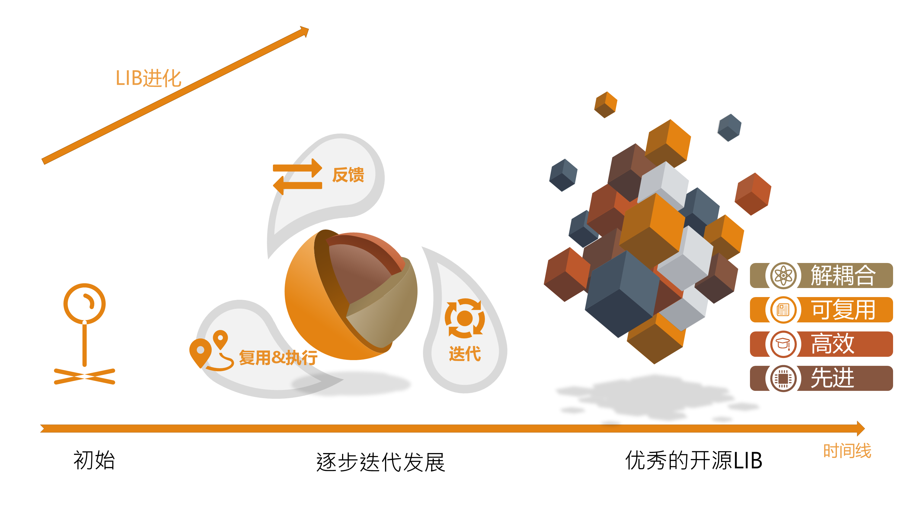

# introduction

LoreGit是一个刚刚发起的开源社区，中文名为浪集

我们希望能在社区聚集更多热爱开源与学术的伙伴，将git的开源方式拓展至学术领域，开源关于学术和知识的更多部分，建立一个更开放更专注于探索的泛开源社区

社区目前以LIB为核心载体，git作为版本控制系统。git本身略为复杂，不过可以简单的理解为公开的，具有协作能力的文件夹，这是一个非常重要的概念，起初可能稍微复杂，但是上手后就会发现它相当强大且高效。

# LIB生命周期       

 **生命周期是一个非常重要的概念，LIB从创建开始，将一直处于发展的状态之中，会有更多人使用，得到更多人反馈，也能够逐步变得更完整更强大**

**创建**  LIB由创建者创建，这一步是一切的开端。良好的初始化即：更高价值的内容，更适当的发展目标，更清晰的协作更新方式，能是的LIB成长更为顺利。

**使用**  LIB创建后将会公开，同时会有更多人看到这个LIB，并且复用LIB中的内容。这个过程能为更多人带来价值，同时更多人用就会有更多人关注，会使之后两个周期变得更为顺畅。

**反馈**  LIB在被使用过程中会被发现更多潜在问题，或更正或需要的更新以及一些相关的问题，这些问题会随着LIB保存使得可以轻松查阅。

**迭代**  反馈带来了更多潜在可修改的地方，这是LIB的所有者或者所有关注LIB的人都可以提出新的修改作为PR。当PR被接受，LIB就完成了更新。在逐步的更新中LIB会变得越来越棒~

**正反馈循环**

正反馈循环是LIB发展的关键，良好的正反馈循环能够促进使用，反馈，迭代三个过程的回转，能够极强地推进LIB的成长和目标实现。可以说对于每个强大而成熟的LIB，适当时间进入正反馈循环是最核心的要素之一，这依赖于其创建者与核心贡献者的有效推动。

**分支与其他**

分支Fork是一个重要的功能，Fork一个LIB可以快速获取一个自己具有完全权限的可编辑LIB，能够快速实现清晰的协同编辑。是git作为分布式版本管理系统的核心功能之一。善用Fork将有效提升复用效率，同时也为LIB发展提供了更多可能。

# 社区&LIB

### 社区的优势

> 使用LIB带来非常多的好处，注意到这种优势关键的有两部分，第一部分是分布式文件管理，第二部分是开源协作
>

#### git特性

LIB通过git管理，支持通常的git特性，能够带来更方便的版本管理。git本身虽有一定学习成本，但网页应用及其相关的GUI、其他工具等能够有效提高生产力。同时git并不约束LIB的内容载体，因此LIB理论上支持任何文件，方便内容复用。

#### 迭代特性

更多参与，更多反馈，更多迭代，良好的社区参与能够有效帮助LIB提升。发现漏洞，提出新想法，相互完善，众人拾柴火焰高。

#### 开放协作

支持多人合作，同时问题讨论及LIB生长过程也会长期保留。避免信息逸散，大量有价值的讨论与过程都能够被保存，帮助更多人。

#### 先进

先进是社区的核心追求之一，就像玩家社区一样，希望所有参与者能够相互分享攻略，开放视野，更加精进，更好地游玩地球online。

#### 全平台

可以通过任何设备登陆网页或操作git以使用LoreGit，带来更多方便。

### 社区对于不同类型参与的价值

> 社区能够为不同类型的参与带来各种价值

#### 创建

> 创建是一切伟大故事的起源

- 展示点子  记录灵光一现，种下一颗种子，慢慢陪伴TA成长
- 构建目标  可以在与社区的诸位协同一起完成想要的LIB
- 发布工作  同步在社区发布工作可以有效提升影响力，可以带来更多使用与潜在协作，还可能增加引用
- 玩玩花活  虽然社区早期方向会多多关注学术，但是有趣的花活也是极好的

#### 推动

- 提交PR  直接参与LIB发展的最好方式，不断更新是LIB发展的核心
- 参与交流  你的已知也许是别人的位置，更多交流更多发展

#### 使用

- 复用  LIB可以快速复用，能减少很多不必要的工作
- 发现问题  使用中发现问题可以通过问题系统提出，相信能够更好解决，同时也为LIB发展助力

#### 初学

- 刚刚入门  尝试功能，参与自己喜欢的LIB，探索未知
- 了解学习  信息的价值正在于使用

#### 参与LoreGit社区事务

- 这将有效地帮助社区变得更好，参与更多规范建设与社区推动，也能够深远地促进社区发展

### 参与者

以上的种种参与方式都不过是简单的缩影，希望每个参与者都能找到自己的兴趣所在，有更多乐趣等待探索

# 现在开始！

目前社区正在初始化阶段，内容较少，但是一切规范均正在建立可以商议、一起方向均是空地可以发展

不必等待，加入社区，一同开拓学术开源的世界吧

#### 目前可以做的

- 发布自己的LIB
- 试用各种LIB，找找兴趣
- 迁移和搬运适当的内容
- 参与标准和说明文档的构建
- 加入社区官方团队！！（真的很需要）

# 目录和简介

作为目录和简介  指向其他相关信息

- 社区使用介绍 [链接](https://loregit.com/LoreGit/guide)
- 中文学术开源指南
- 社区特性与准则 [链接](./LoreGit社区特性及准则.md)
- LoreGit愿景及FQA  [链接](./愿景&FQA.md)
- 团队介绍及招募  [链接](./关于我们.md)
- LIB规范
- LIB例子
- 等等
- 讨论群及反馈 [链接](./讨论群及反馈.md)

# 目前正在建设中~

目标是把社区和功能等都介绍的更详细一些

# 致谢

感谢GNU及其推动者Richard Matthew Stallman，希望能追寻其步伐  

感谢git的作者 Linus Torvalds 和所有使用，参与，贡献git的人。git是一个非常棒的产品，希望未来能有机会做个更好的

感谢gogs的作者unknown  感谢gogs社区和gitea社区 ，前瞻版本和初期版本都从中受益匪浅

感谢所有加入LoreGit的同好们，相信未来我们能走的更远！

